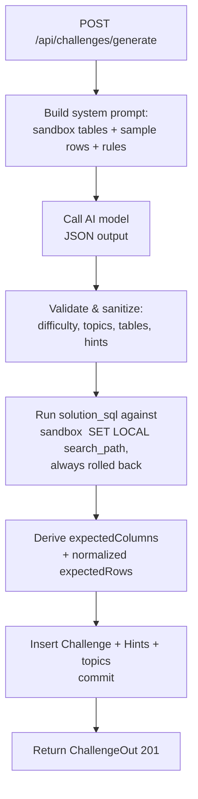

# AI Challenge Generation

How SQLdle creates a brand‑new SQL challenge with an AI agent and stores it in
the `challenges` table.

---

## TL;DR

`POST /api/challenges/generate` asks an AI model to author a challenge against
the shared `sandbox` tables. The model returns the creative parts **and a
canonical solution SQL**. The backend then **runs that SQL against the sandbox**
to compute the real answer key (`expectedColumns` / `expectedRows`), saves the
challenge, and returns it.

The model never decides the graded answer — the database does.

---

## Endpoint

```
POST /api/challenges/generate
Content-Type: application/json
```

### Request body (all fields optional)

| field        | type                                       | description                                                        |
| ------------ | ------------------------------------------ | ------------------------------------------------------------------ |
| `difficulty` | `"easy" \| "medium" \| "hard" \| "expert"` | Steer the difficulty.                                              |
| `topics`     | string[]                                   | Preferred topic slugs (e.g. `["joins","aggregation"]`).            |
| `tables`     | string[]                                   | Preferred sandbox tables (e.g. `["customers","orders"]`).          |
| `theme`      | string                                     | Freeform guidance, e.g. `"a revenue question with a tie-breaker"`. |

An empty body `{}` is valid — the agent picks everything.

### Response

`201 Created` with the full challenge (same shape as `GET /api/challenges/{key}`):

```jsonc
{
  "id": "ch-orders-per-country",
  "slug": "orders-per-country",
  "title": "Orders per country",
  "difficulty": "easy",
  "topics": ["joins", "aggregation"],
  "estimatedMinutes": 6,
  "prompt": "Count orders per country. Output `country`, `order_count` ...",
  "schema": [
    /* the sandbox tables used */
  ],
  "expectedColumns": ["country", "order_count"],
  "expectedRows": [
    ["US", 5],
    ["DE", 2],
    ["GB", 1],
  ],
  "starterSql": null,
  "hints": [
    { "id": "ch-orders-per-country-h1", "text": "Join on customer_id." },
  ],
  "editorial": "Join the fact table to the dimension, then group and count.",
}
```

### Errors

| status | when                                                                                                                                     |
| ------ | ---------------------------------------------------------------------------------------------------------------------------------------- |
| `503`  | AI is not configured (no `OPENAI_API_KEY`).                                                                                              |
| `422`  | The model returned unusable output (bad JSON, no known table, or its `solution_sql` failed / wasn't a single read‑only `SELECT`/`WITH`). |

Errors use the standard envelope: `{ "error": { "code": "...", "message": "..." } }`.

---

## Configuration

Set these in `app/.env` (read by [app/utils/config.py](app/utils/config.py)):

| env var           | required        | default        | notes                                                             |
| ----------------- | --------------- | -------------- | ----------------------------------------------------------------- |
| `OPENAI_API_KEY`  | yes (to enable) | —              | Empty/unset → endpoint returns `503`.                             |
| `OPENAI_BASE_URL` | no              | OpenAI default | Point at Azure OpenAI / Foundry / any OpenAI‑compatible endpoint. |
| `OPENAI_MODEL`    | no              | `gpt-4o-mini`  | Any chat model that supports JSON output.                         |

Uses the official `openai` Python SDK (pinned in `requirements.txt`), so the
same code targets OpenAI, Azure, and local/compatible servers just by changing
the base URL.

---

## How it works (flow)



Source: [app/services/ai_challenge.py](app/services/ai_challenge.py), wired into
[app/api/routers/challenge.py](app/api/routers/challenge.py).

### Step by step

1. **Prompt.** A system prompt embeds the exact `SHARED_TABLES` (columns +
   the real seeded sample rows) and the authoring rules — single read‑only
   statement, `created_at` is a `TIMESTAMP`, prompt must state output columns
   and ordering, allowed difficulties/topics, and "use only these tables".
2. **Model call.** The model is asked to reply with a strict JSON object
   containing `title`, `slug`, `difficulty`, `topics`, `tables`,
   `estimated_minutes`, `prompt`, `starter_sql`, `hints`, `editorial`, and the
   canonical `solution_sql`.
3. **Validation.** The backend constrains `difficulty`/`topics`/`tables` to the
   known allowed values, derives a clean slug, clamps `estimated_minutes`, and
   requires at least one known sandbox table.
4. **Deterministic answer key.** The `solution_sql` is checked to be a single
   read‑only `SELECT`/`WITH`, then executed against the `sandbox` schema inside
   a transaction that is **always rolled back**. The returned columns become
   `expectedColumns`; the rows are normalized (Decimal→int, timestamps→ISO `T`,
   dates→`YYYY-MM-DD`, NULL→null) and become `expectedRows`.
5. **Persist.** A new `Challenge` row (plus `Hint`s and topic links) is inserted
   with a unique `id`/`slug`, then returned to the caller.

---

## Why derive the answer key instead of trusting the model

LLMs are good at writing a SQL question and a solution query, but unreliable at
mentally executing that query over a dataset. By running the model's
`solution_sql` against the real sandbox, the graded `expectedRows` are
guaranteed correct and consistent with the data players query — eliminating the
"hallucinated result set" failure mode entirely.

This mirrors the normal submission grader: both use the same `sandbox` schema,
the same read‑only check, and the same value normalization
([app/api/routers/submissions.py](app/api/routers/submissions.py)).

---

## Examples

### Minimal

```bash
curl -X POST http://localhost:8000/api/challenges/generate \
  -H "Content-Type: application/json" -d "{}"
```

### Steered

```bash
curl -X POST http://localhost:8000/api/challenges/generate \
  -H "Content-Type: application/json" \
  -d '{
        "difficulty": "hard",
        "topics": ["window-functions", "ctes"],
        "tables": ["orders", "customers"],
        "theme": "rank customers by month-over-month revenue growth"
      }'
```

---

## Notes & limits

- The generated challenge persists immediately; there is no human review step.
  Delete unwanted rows directly from the `challenges` table if needed.
- Quality depends on the chosen model. A stronger `OPENAI_MODEL` yields better
  prompts/editorials.
- The agent can only use the existing sandbox tables. To broaden what it can
  ask, extend `SHARED_TABLES` (see [CHALLENGE_AUTHORING.md](CHALLENGE_AUTHORING.md))
  and rebuild with `python -m app.db.sandboxes`.
